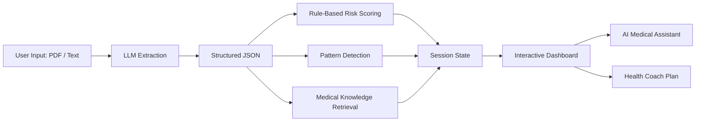

# 🧬 Diagnova  
### AI-Powered Lab Report Interpreter for Patients

**Empowering patients by translating complex medical reports into clear, actionable health insights.**

[🚀 Live Demo](https://diagnova.streamlit.app/) ·  
[📋 Technical Overview](#-technical-architecture) ·  
[⚕️ Medical Disclaimer](#-medical-disclaimer)

---

## 🌟 What Problem Does Diagnova Solve?

Medical lab reports are written for doctors — not patients.

Patients often receive:
- Confusing numbers  
- Medical jargon  
- No clear explanation of what’s *normal*, *borderline*, or *serious*

**Diagnova bridges this gap.**

It transforms raw lab reports into **easy-to-understand explanations**, highlights **abnormal results**, and guides users on **what to do next** — safely and responsibly.

---

## 🧪 What Diagnova Does

- 📄 Accepts **PDF lab reports** or **pasted lab text**
- 🔍 Extracts key medical values automatically
- 🚦 Flags results as **Normal / Borderline / Abnormal**
- 🧠 Explains what each parameter means in **simple language**
- 🔗 Detects patterns across multiple tests (e.g. anemia, infection)
- 💬 Provides a **context-aware AI medical assistant**
- 🏃 Generates a **personalized health coach plan**
- 🌍 Supports **multi-language summaries**

---

## 🔄 How It Works (Simple Flow)

1. **User Uploads Report**  
   PDF or raw lab text

2. **AI Extraction**  
   LLM converts unstructured text into structured clinical data

3. **Analysis Engine**
   - Rule-based medical validation
   - Multi-parameter reasoning
   - Grounded medical explanations

4. **Dashboard**
   - Visual cards for each test
   - Risk indicators
   - AI chat + health coach

---

## 🏗️ Technical Architecture

Diagnova uses a **hybrid GenAI + deterministic system** to stay accurate and safe.

---

## 🧠 GenAI Features (Judge-Friendly)

### 1️⃣ Structured AI Extraction
Instead of brittle regex, Diagnova uses LLM-based extraction to handle:
- Any lab format
- Any hospital layout
- Messy or partial reports

### 2️⃣ Grounded Medical Explanations (RAG)
AI explanations are not hallucinated. Each explanation is generated using:
- Verified medical definitions
- Reference ranges
- Controlled prompts
The AI is strictly instructed to explain — never diagnose or prescribe.

### 3️⃣ Multi-Parameter Reasoning
Diagnova doesn’t analyze values in isolation.
Examples:
- **Low Hemoglobin + Low MCV** → Possible anemia pattern
- **High WBC + Neutrophils** → Infection indicators
- **Creatinine + Urea** → Kidney health context

### 4️⃣ AI Confidence Scoring
Each analysis includes a confidence score based on:
- Extraction reliability
- Number of available parameters
- Strength of detected medical patterns

---

## 🧩 Code Structure (Simplified)

- **`app.py`** — Streamlit UI & layout
- **`extractor.py`** — LLM + regex fallback extraction
- **`analyzer.py`**
  - Risk scoring
  - Pattern detection
  - Summary & health coach generation
- **`chat_handler.py`** — Context-aware AI assistant
- **`reference_ranges.py`** — Medical ground truth

---

## 🌍 Multi-Language Support

Diagnova supports instant translation of summaries into:
- Spanish
- Urdu
- Hindi
- Arabic
- French
- German

Healthcare clarity should be global.

---

## ⚠️ Current Limitations

- Image OCR is experimental (PDF & text work best)
- Focused on common panels (CBC, LFT, KFT, Lipids)
- One report at a time (longitudinal analysis planned)

---

## ⚕️ Medical Disclaimer

Diagnova is an educational tool only. It does not replace professional medical advice, diagnosis, or treatment. Always consult a qualified healthcare provider for medical decisions.

---

Built for the Hugging Face Medical Hackathon
🧬 Diagnova — Your Health, Decoded.

