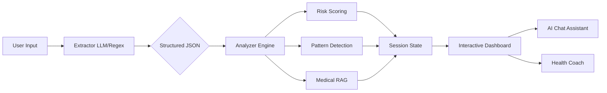

# 🧬 Diagnova
### Advanced AI-Powered Lab Report Interpreter

**Empowering patients by translating complex medical data into clear, actionable health intelligence.**

[🚀 Live Demo](https://huggingface.co/spaces/Ameer-Hamza-Afridi/Diagnova) · [📋 Documentation](#-technical-architecture) · [⚕️ Medical Disclaimer](#-medical-disclaimer)

---

## 🌟 High-Level Functionality

Diagnova is a patient-centric medical intelligence platform that transforms cryptic lab reports into understandable clinical insights.

- **Seamless Input**: Users can upload PDF reports or paste raw lab results directly into the interface.
- **Instant Interpretation**: Within seconds, the system extracts values, identifies clinical significance, and flags abnormal parameters.
- **Interactive Health Journey**: Beyond simple analysis, users can chat with an AI medical assistant, receive a personalized health coach plan, and view results in their native language.

### Input/Output Flow
1. **Input**: PDF/Image upload or Text paste.
2. **AI Extraction**: LLM-powered extraction converts unstructured text into a structured JSON payload.
3. **Analysis Engine**: Rule-based scoring + Medical RAG provide clinical context for every number.
4. **Dashboard**: Interactive tabs showing card-based results, health coach plans, and a medical assistant chat.

---

## 🏗️ Technical Architecture

Diagnova follows a modular, decoupled architecture centered around a **GenAI-First** design pattern.

### Core Modules
- **`app.py`**: The Streamlit entry point. Manages global CSS tokens, hero sections, and high-level layout orchestration.
- **`extractor.py`**: The "Sensor" layer. Uses **Llama 3.3 (70B) via Groq** for precision NER (Named Entity Recognition) to extract test names and values, with a regex fallback.
- **`analyzer.py`**: The "Intelligence" layer.
    - **Rule Engine**: Validates values against `reference_ranges.py`.
    - **Pattern Engine**: Detects clinical relationships (multi-parameter reasoning).
    - **Summary & Coach**: Generates grounded narratives and lifestyle plans.
- **`chat_handler.py`**: Manages conversational state and contextual grounding for the AI Assistant.
- **`result_dashboard.py`**: The "Presentation" layer. Features a custom CSS-driven UI with persistent tab state management.

### Data Flow

---

## 🤖 GenAI Components

### 1. Medical RAG Explanations
Rather than generic LLM guesses, every test explanation is grounded in a curated internal **Medical Knowledge Base**. The AI combines the specific test value with verified medical definitions to generate a safe, educational explanation.

### 2. Multi-Parameter Reasoning (Pattern Detection)
The system doesn't just look at single points. It performs **Reasoning-over-Relationships**:
- **Anemia Detection**: Linking low Hemoglobin with low MCV.
- **Infection Markers**: Correlating elevated WBC with neutrophil shifts.
- **Kidney Integrity**: Evaluating Creatinine and Urea concurrently.

### 3. Personalized Health Coach
By combining the **User Profile** (Age, Activity, Goals) with the **Clinical Findings**, Diagnova generates a tailored lifestyle roadmap in Markdown format, covering:
- Specific actionable steps.
- Targeted nutrition strategies.
- Activity plans suited to the user's current health status.

### 4. Diagnova AI (Chat Assistant)
A context-aware Conversational AI grounded in the user's specific analysis results. It uses a specialized system prompt to ensure:
- **Grounding**: ONLY talks about the provided results.
- **Safety**: NEVER prescribes; always encourages physician consultation.
- **Empathy**: Professional yet accessible tone.

---

## 🔌 Integration & Session State

- **Session State Management**: Used to maintain "Persistence of Intelligence." Once an analysis is performed, the results, chat history, and active tab are stored, allowing the user to navigate and chat without losing their context.
- **Module Interaction**: 
    - `result_dashboard` triggers the `process_lab_results` in `analyzer`.
    - `analyzer` calls `generate_health_coach_plan` and `generate_summary_ai`.
    - `chat_handler` reads the `full_analysis` object from state to ground its responses.
- **Risk Scoring**: Occurs in `analyzer.py:assess_risk`, assigning `green` (Normal), `yellow` (Borderline), or `red` (Abnormal) based on clinical reference ranges.

---

## 🌍 Multi-Language Support
Recognizing that healthcare clarity is a global right, Diagnova supports one-click dynamic translation of the AI summary into:
- 🌍 **Spanish, Urdu, Hindi, Arabic, French, and German.**

---

## ⚠️ Current Limitations & Edge Cases

- **Image OCR**: Currently, the UI supports image upload, but the underlying OCR engine is a placeholder. PDF and Text-pasting are primary.
- **Complex Rare Diseases**: The rule engine and patterns focus on common diagnostic panels (CBC, LFT, KFT, Lipids). Extremely rare markers may only get individual RAG explanations.
- **Multiple Reports**: Limited to analyzing one report at a time; longitudinal trend analysis across years is a roadmap feature.

---

## ⚕️ Medical Disclaimer

Diagnova is an **educational tool** designed to help you understand your lab results. It does **not** replace professional medical advice, diagnosis, or treatment. Always consult a qualified healthcare provider with questions about your health.

---

Built for **Hugging Face Medical Hackathon**
**🧬 Diagnova — Your Health, Decoded.**

